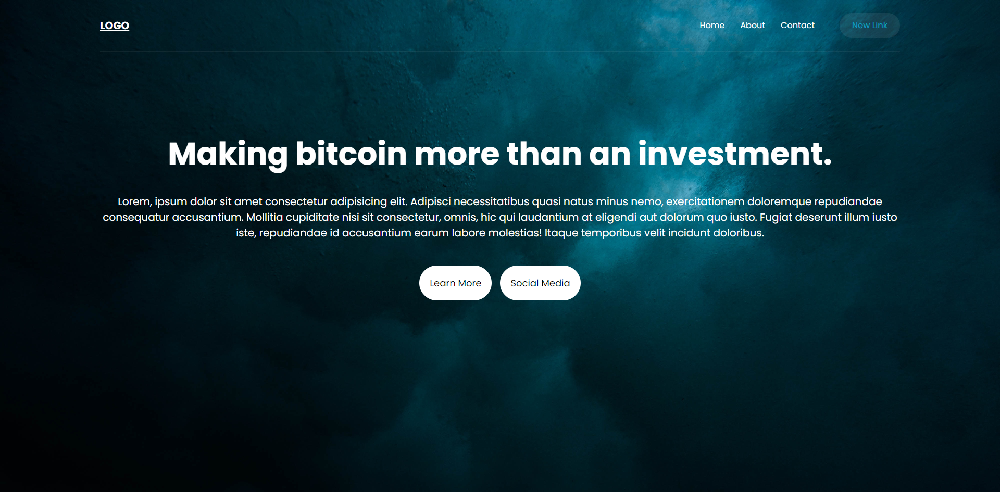

## Responsive Simple Website with Html Css.

**live demo: [https://steady-froyo-4e161a.netlify.app](https://steady-froyo-4e161a.netlify.app)**

## Instructions

First clone this repository.

```bash
$ git clone https://github.com/mehmetulker/Simple-Website-with-Html-Css.git
```
